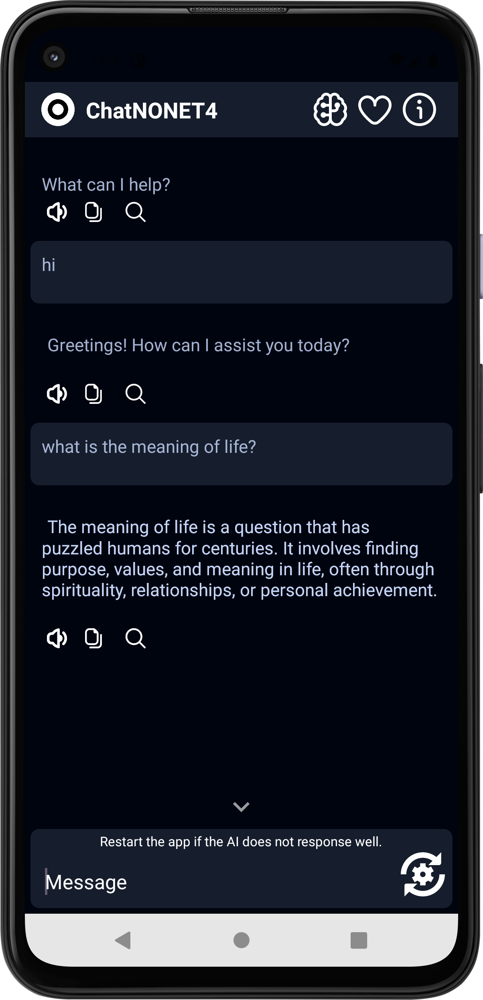
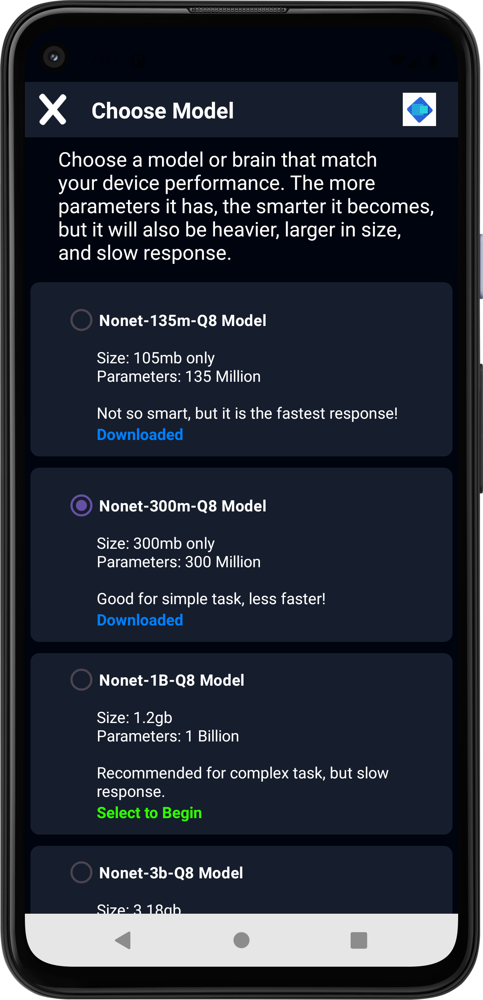
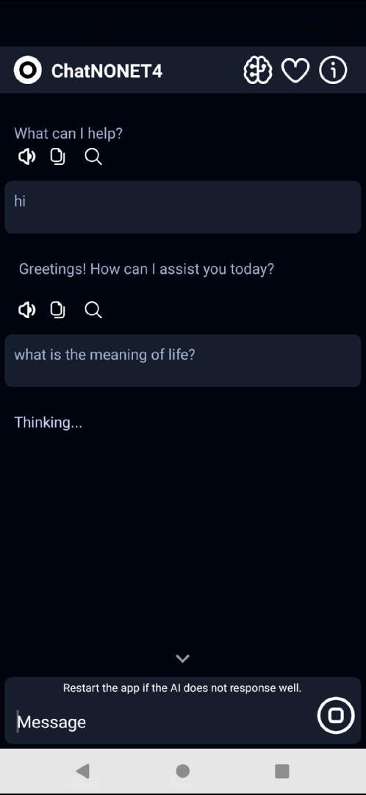

# ChatNONET (Offline/local AI Assistant) for Android

ChatNONET is an **offline AI chatbot app** for Android that runs **local Large Language Models (LLMs)** using the quantized `GGUF` models from the `ChatNONET` family (135M, 300M, 1B, and 3B sizes). It uses `llama.cpp` in the backend to run the model without needing any internet connection.

## Features

- 🧠 Fully offline chatbot powered by a local LLM
- ⚡ Fast inference using quantized GGUF models
- 📱 Android-compatible (built with Android Studio)
- 📂 Plug-and-play support for multiple model sizes
- 💬 Optimized for direct Q&A-style interactions

## App Demo

> 📥 [Download APK](https://huggingface.co/McaTech/Nonet/resolve/main/ChatNONET4.apk)

## Screenshots & Realtime Generation (Qualcomm Snapdragon 730G)

| Chat Interface | Model Selection | Generation | 
|----------------|-----------------|-----------------|
|  |  | 

## Getting Started

### Requirements

- Android Studio (Ladybug Feature Drop)
- Android SDK 35+
- A physical Android device (recommended for testing models)

### Clone the Project

```bash
git clone https://github.com/Mca-Tech/ChatNONET.git
```

### Run on Android Studio

- Open the project in Android Studio.
- Sync Gradle.
- Connect your Android device or use an emulator.
- Download all the [Precompiled Binaries for Android](https://example.com/chatnonet.apk).
- Copy all the binaries like this:
    ```
    ChatNONET4/
    ├── app/
    │   ├── src/
    │   │   ├── main/
    │   │   │   ├── java/...
    │   │   │   ├── jniLibs/          # Native llama.cpp build (compiled .so)
    │   │   │   │    ├── arm64-v8a/
    │   │   │   │    ├── armeabi-v7a/
    │   │   │   │    ├── X86/
    │   │   │   │    ├── x86_64/
    ```
- Run the app.
- And happy chat

## License

This project is licensed under the **Apache 2.0 License**. See the `LICENSE` file for more details.

## Credits

- Core Developer: [Michael Cobol Agan (McaTech)](https://www.facebook.com/michael.cobol.agan.2025/)
- Model: [NONET](https://huggingface.co/McaTech/Nonet)
- Backend: [llama.cpp](https://github.com/ggerganov/llama.cpp)

---

> ✨ If you like this project, feel free to star ⭐ the repo or contribute!
